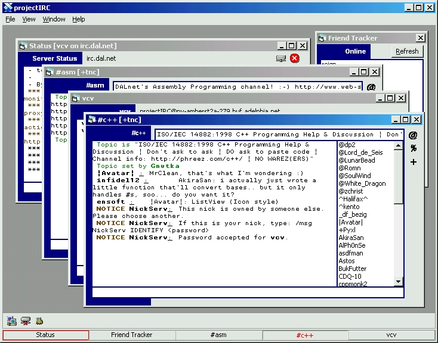



## projectIRC 1\.026 \(Another Update\!\)

### Description

Yet another update. This time I added the "friend tracker", basically just a notify lists to see who's on. I added support for hyperlinks, so you can right click addresses and it will shell to them. The taskbar will now notify you when an inactive window has new data. Fixed a few bugs. A few of the options work now, and save. There is a "debug" window, which just displays all incoming and outgoing data. You can move both the toolbar and taskbar to the top or bottom. That's about it I think, enjoy.
 
### More Info
 

             |
---                |---
**Submitted On**   |2000-09-24 23:10:40
**By**             |[vcv](https://github.com/Planet-Source-Code/PSCIndex/blob/master/ByAuthor/vcv.md)
**Level**          |Advanced
**User Rating**    |4.5 (36 globes from 8 users)
**Compatibility**  |VB 6\.0
**Category**       |[Complete Applications](https://github.com/Planet-Source-Code/PSCIndex/blob/master/ByCategory/complete-applications__1-27.md)
**World**          |[Visual Basic](https://github.com/Planet-Source-Code/PSCIndex/blob/master/ByWorld/visual-basic.md)
**Archive File**   |[CODE\_UPLOAD101369242000\.zip](https://github.com/Planet-Source-Code/vcv-projectirc-1-026-another-update__1-11655/archive/master.zip)

